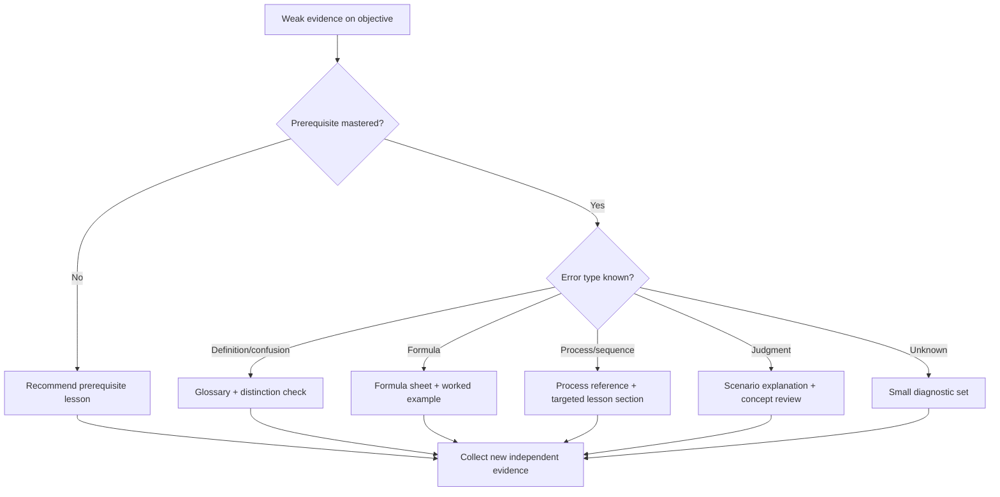

# Adaptive Learning Model

## Purpose and boundary

The future adaptive layer recommends the smallest useful next activity from
objective-level evidence. This document defines the state, signals, decisions,
and safeguards; it does not implement a scoring, scheduling, or recommendation
algorithm.

Adaptive behavior remains deterministic and local-first. No AI API is required
to track mastery or select a lesson. Canonical content and learner state remain
separate.

## Evidence hierarchy

```text
Question attempt / lesson check / review event
                 ↓
Objective evidence
                 ↓
Concept mastery estimate
                 ↓
Prerequisite and weak-area analysis
                 ↓
Lesson / reference / quiz / review recommendation
```

ECO-domain accuracy is useful reporting context but is too coarse to drive
remediation. Objective IDs are the atomic mastery unit.

## Learner-state boundary

A future learner store should be keyed by objective ID and may include:

```json
{
  "objective_id": "C038-O1",
  "mastery_state": "Developing",
  "confidence_score": 0.62,
  "evidence_count": 4,
  "independent_item_count": 3,
  "last_evidence_at": "ISO-8601 timestamp",
  "last_reviewed_at": "ISO-8601 timestamp",
  "next_review_at": "ISO-8601 timestamp",
  "lapse_count": 1,
  "evidence_refs": [],
  "version": 1
}
```

This state must not be written into `data/learning_objectives.json`, lesson
records, question records, or other seed content.

## Mastery tracking

Recommended states are `Not Started`, `Exposed`, `Developing`, `Proficient`,
and `Mastered`. State transitions require an approved evidence policy.

Evidence may later include:

- independently reviewed question attempts mapped to the objective;
- lesson checks or worked-example decisions;
- delayed retrieval results;
- explanation/confidence prompts when the UI supports them;
- lapses after prior proficiency.

One repeated item, one lesson completion, or one broad ECO score is never
sufficient to declare mastery. The current planning threshold is 80 percent
with at least three distinct evidence items for every objective; this is a
policy proposal, not calibrated truth.

## Confidence scoring

Confidence should express evidence sufficiency, not learner self-esteem or
model certainty. Future scoring may consider correctness, cognitive demand,
reviewed item difficulty, recency, independence, attempts, and consistency.

Guardrails:

- cap confidence when evidence is sparse or uncalibrated;
- discount repeated exposure to the same item or rationale;
- do not treat current bank scores as reliable until answer cues are fixed;
- store the evidence behind a score so recommendations are explainable;
- surface uncertainty instead of inventing precision.

## Prerequisite unlocking

A concept is eligible when all prerequisite concepts meet the approved
threshold or an explicit diagnostic waiver. Module order supplies a default
sequence; `data/knowledge_graph.json` supplies the actual dependency edges.

Unlocking states should distinguish:

- `Locked — prerequisite not introduced`;
- `Recommended prerequisite review`;
- `Eligible`;
- `In progress`;
- `Complete but review due`.

Learners may choose to override recommendations in a local study tool, but the
UI should explain the expected prerequisite gap.

## Weak-area detection

A weak area is a pattern, not one wrong answer. Detection should separate:

- missing prerequisite knowledge;
- definition or distinction confusion;
- formula selection/calculation error;
- process sequencing error;
- scenario judgment/mindset error;
- careless or low-confidence response;
- stale knowledge after prior mastery.

Misconception tags and objective mappings are needed before this classification
can be trustworthy.

## Recommendation types

### Lesson recommendations

Recommend the smallest planned/implemented lesson that covers the weak
objective, or its unmet prerequisite. Do not recommend a whole ECO task when a
single concept is the gap.

### Quiz recommendations

Assemble independent, reviewed items across weak objectives while respecting
recency, repetition, item exposure, blueprint needs, and difficulty. The
current bank cannot drive valid adaptive quizzes until answer-position/length
bias and objective mappings are remediated.

### Reference recommendations

Recommend glossary entries, formulas, or reference sheets for retrieval and
comparison after the learner has received instruction. A reference sheet is
not a substitute for a missing concept lesson.

### Review recommendations

Schedule short retrieval for objectives that are proficient but due, concepts
with recent lapses, and prerequisite concepts supporting upcoming lessons.

## Remediation pathways



## Spaced-repetition compatibility

The model supports any independently approved scheduler by storing due dates,
stability/difficulty estimates, lapses, and evidence references separately.
Review prompts must derive from approved objectives, misconceptions, formulas,
or distinctions. Scheduling logic must be pure, versioned, and tested; changing
it must not mutate canonical content.

## Completion logic

### Objective completion

All mastery-threshold requirements are met with sufficient distinct evidence.

### Lesson completion

All required objectives are mastered and required activities are complete.
Opening or scrolling a lesson is exposure, not completion.

### Concept completion

All concept objectives are mastered; outstanding review dates do not erase
completion but may change the recommendation state.

### Module completion

All required concept units are complete. Optional reference assets do not
block completion unless explicitly configured.

### Course completion

All required modules and objectives are complete under the active curriculum
edition. ECO Review and comprehensive-course completion remain separate views.

## Privacy, auditability, and failure modes

- Keep learner data local unless a separately approved sync feature exists.
- Store no telemetry or personal data by default.
- Every recommendation should name the evidence and prerequisite rationale.
- Never claim psychometric calibration without adequate reviewed data.
- Degrade to ordinary user-selected study when metadata is missing.
- Version state and migration logic so content ID changes do not erase history.

## Implementation gates

Do not implement adaptive recommendations until objective IDs, question
mappings, answer-cue remediation, reviewed difficulty/cognitive metadata, and
evidence rules are approved and validated.
