# Content Production Pipeline

## Purpose

This pipeline turns approved source research and curriculum gaps into reviewed,
traceable learning assets. It prevents AI or human drafting from bypassing the
knowledge graph, objectives, quality controls, or User approval.

No stage in this document authorizes production content automatically.

## End-to-end flow

```mermaid
flowchart TD
  S[Source Material] --> V1{Source and licensing checkpoint}
  V1 --> K[Knowledge Graph]
  K --> V2{Concept identity and dependency checkpoint}
  V2 --> C[Concept Definition]
  C --> V3{Objectives, scope, mappings, approval checkpoint}
  V3 --> LD[Lesson Draft]
  LD --> V4{Structural and overlap checkpoint}
  V4 --> LR[Lesson Review]
  LR --> V5{Technical, source, instructional, User review}
  V5 --> QG[Question Generation]
  QG --> V6{Schema, originality, balance checkpoint}
  V6 --> QR[Question Review]
  QR --> V7{Correctness, distractor, batch-quality review}
  V7 --> RS[Reference Sheets]
  RS --> V8{Retrieval, relationship, accessibility review}
  V8 --> G[Glossary]
  G --> V9{Definition and confusion review}
  V9 --> A[Adaptive Learning Mapping]
  A --> V10{Evidence and prerequisite readiness checkpoint}
  V10 --> R[Release Candidate]
  R --> V11{Tests, docs, map, User approval}
  V11 --> REL[Release]
```

Reference sheets and glossary entries may be drafted alongside lessons when an
approved concept requires them, but they still pass their own checkpoints.

## Stage contracts and checkpoints

### 1. Source material

**Inputs:** approved official/licensed sources and local research pointers.

**Checkpoint:** source ID exists; edition, license/use boundary, locator, and
verification date are recorded; no source text is copied into the repository.

**Reject when:** authority is unclear, terminology conflicts are unresolved, or
transmission to an external AI has not been authorized.

### 2. Knowledge graph

**Inputs:** approved catalog gap and source-topic evidence.

**Checkpoint:** stable concept ID; title; parent/child, prerequisite, and related
links; ECO/PMBOK mappings; asset relationships; no cycle or dangling reference.

**Reject when:** the proposed concept duplicates an existing unit or combines
independently assessable capabilities.

### 3. Concept definition

**Inputs:** graph node, coverage record, source plan.

**Checkpoint:** purpose, scope, exclusions, two-to-five measurable objectives,
competencies, Bloom level, time/difficulty hypothesis, mastery threshold, and
misconceptions are reviewed and User-approved.

**Reject when:** objectives are unmeasurable, prerequisites are absent, or the
scope is an ECO-task catch-all.

### 4. Lesson draft

**Inputs:** Approved concept/objectives and lesson generation contract.

**Checkpoint:** metadata validates; objectives are visibly covered; original
examples, distinctions, application guidance, source notes, and assessment plan
are present; no production question is generated as a side effect.

### 5. Lesson review

**Checkpoint sequence:** structural → overlap → technical → source →
instructional → assessment-plan → User review. Each reviewer records status,
evidence, date, and required changes.

**Reject when:** content is technically unsupported, copied/closely paraphrased,
misaligned with objectives, or dependent on an unbuilt renderer without a
separate implementation plan.

### 6. Question generation

**Inputs:** Approved objectives, reviewed lesson, requested evidence gap, item
types, cognitive/difficulty distribution, and predetermined answer positions.

**Checkpoint:** generation contract, target count, source boundary, schema, and
batch controls are explicit. Generate only the requested draft items.

### 7. Question review

**Checkpoint sequence:** schema → objective alignment → answer correctness →
distractor plausibility → originality/duplicate → batch balance → terminology →
User review.

**Reject when:** more than one answer is defensible; answer position, length,
grammar, or tone reveals the answer; metadata is incomplete; or the batch
worsens bank bias.

### 8. Reference sheets

**Checkpoint:** approved type and purpose; parallel comparison dimensions;
known concept/glossary/formula links; source review; accessibility and print
requirements; no source table or chart reproduced.

### 9. Glossary

**Checkpoint:** concise original definition; common confusion and exam trap;
known concept/lesson/formula/reference links; source traceability; no competing
definition for the same semantic ID.

### 10. Adaptive mapping

**Checkpoint:** every mastery-eligible question maps to reviewed objectives;
prerequisites are acyclic; evidence independence and confidence rules are
approved; no cue-biased or unreviewed item contributes mastery evidence.

Adaptive code is a later slice and is not required to release canonical
content when adaptive metadata is intentionally absent.

### 11. Release

**Checkpoint:** code/data → focused tests → full tests → docs → app map → Review
→ User approval → commit/PR. Production JSON is formatted, references resolve,
content counts are derived, build passes, and no local source file is included.

## Roles and approvals

| Activity | Responsible | Approval |
|---|---|---|
| Architecture and validation implementation | Codex or Claude Code per task | User after review |
| Curriculum/lesson drafting | Claude per collaboration agreement | User |
| Architecture consistency review | ChatGPT | User |
| Technical/content accuracy review | Assigned human/AI reviewer with evidence | User |
| Repo docs/map hygiene | Codex | User |

AI-generated drafts never approve themselves. The User remains the final
authority for lifecycle transitions.

## Batch artifacts

Every content batch should produce:

- approved input manifest;
- changed concept/objective/asset IDs;
- source and reviewer coverage;
- validation and duplicate reports;
- question position/length/type/difficulty distributions when applicable;
- relationship-diff report;
- tests/build evidence;
- updated progress, app map, and decision log where required.

## Failure and rollback

Reject or quarantine a batch rather than weakening tests. Stable IDs are not
deleted; use deprecation/supersession metadata. A failed migration restores the
previous canonical files and separately records the reason. Learner-state
migrations must preserve evidence provenance or explicitly invalidate it.
