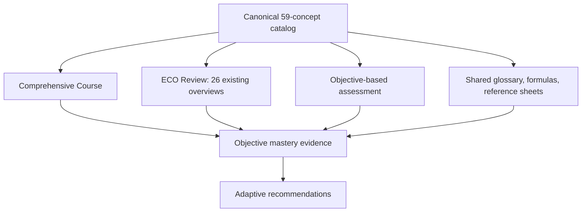
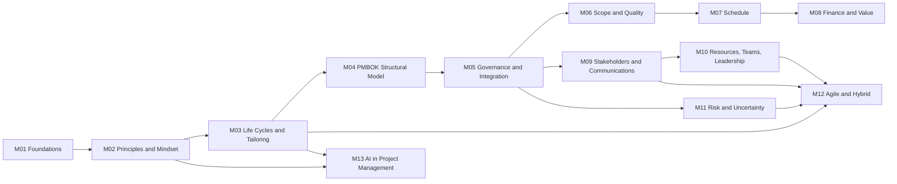
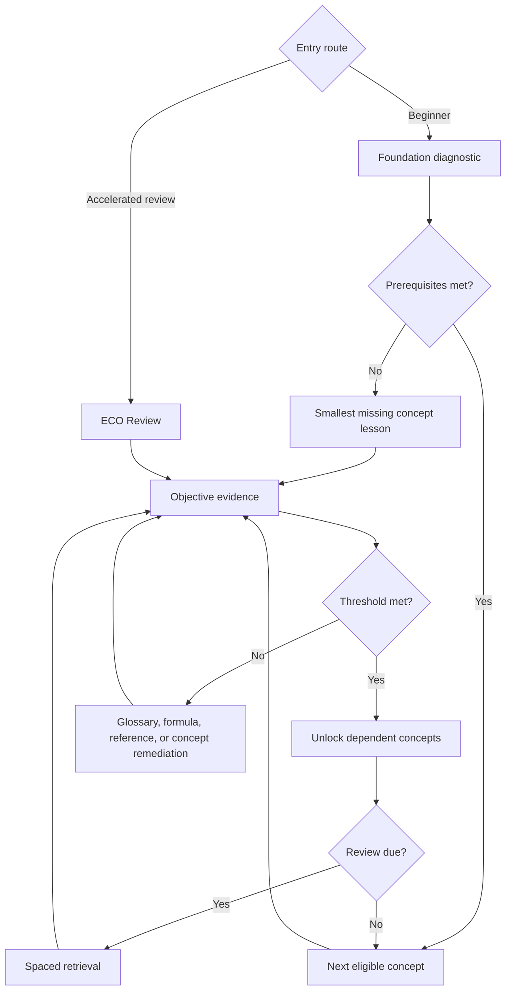

# Curriculum Map

## Curriculum layers

The Comprehensive Course teaches concepts in prerequisite order. ECO Review
compresses them into exam-task views. Both tracks reference the same concept
and objective IDs.

## Module sequence

## Planned concept lessons by module

```mermaid
flowchart TD
  M01 --> C001 & C002 & C003 & C004 & C005 & C006 & C007 & C008 & C009
  M02 --> C010 & C011 & C012 & C013 & C014 & C015 & C016
  M03 --> C017 & C018 & C019 & C020 & C021 & C022
  M04 --> C023
  M05 --> C024 & C025 & C026 & C027 & C028 & C029
  M06 --> C030 & C031 & C032 & C033 & C034
  M07 --> C035 & C036
  M08 --> C037 & C038 & C039
  M09 --> C040 & C041
  M10 --> C042 & C043 & C044
  M11 --> C045 & C046 & C047
  M12 --> C048 & C049 & C050 & C051 & C052 & C053 & C054 & C055
  M13 --> C056 & C057 & C058 & C059
```

Each concept maps one-to-one to a planned lesson ID `PL-C###` for planning.
This does not assign a production lesson ID or approve drafting.

## Learner flow

## Completion views

- **Objective:** sufficient distinct, reviewed evidence.
- **Concept lesson:** all required objectives mastered.
- **Module:** all required concepts complete.
- **Comprehensive Course:** all required modules complete for the active edition.
- **ECO Review:** all selected task overviews reviewed; not equivalent to
  comprehensive concept mastery.
- **Exam readiness:** separately defined and cannot be inferred from course
  completion until the bank is quality-controlled and calibrated.
