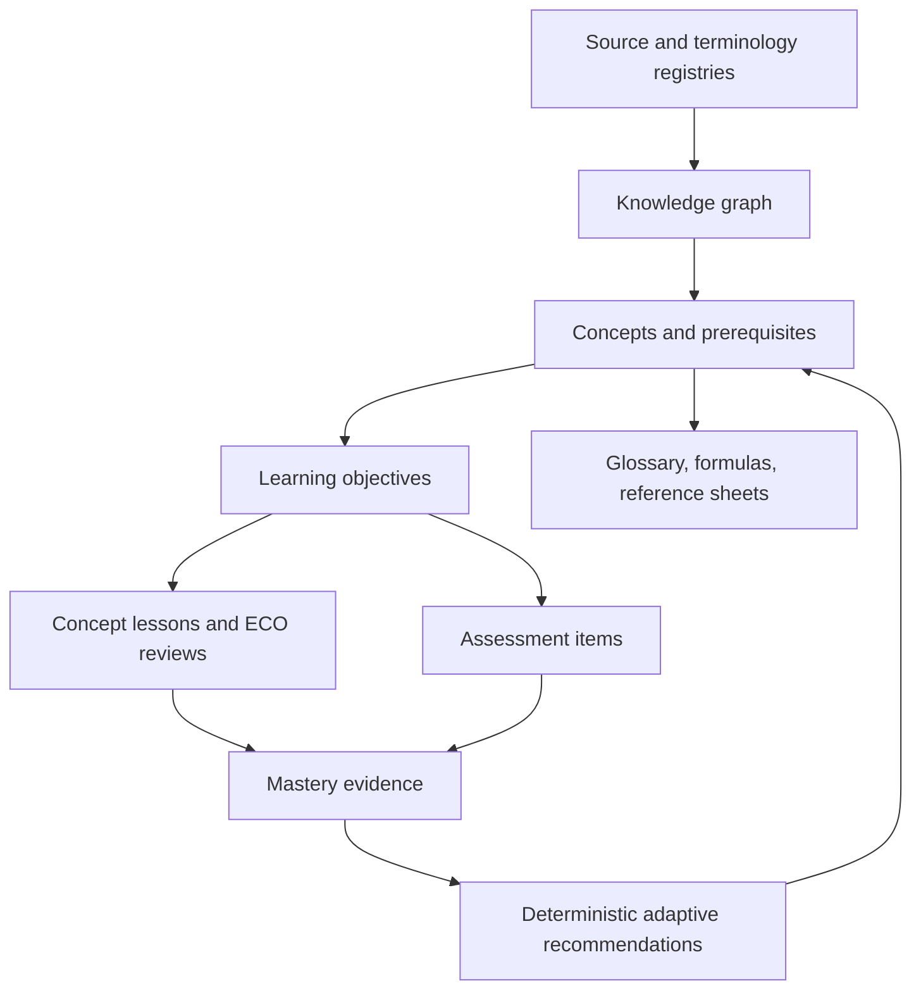
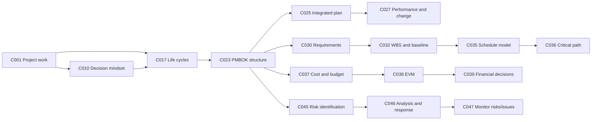
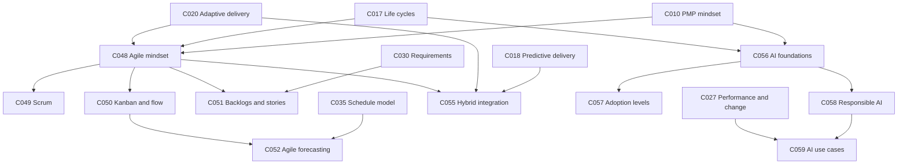

# PMP Knowledge Graph

## Purpose

The knowledge graph is the instructional dependency layer beneath the
59-unit curriculum catalog. It separates four relationships that are often
collapsed in course outlines:

- **parent/child** — broader and narrower concepts;
- **prerequisite** — knowledge that should be mastered first;
- **related** — useful comparison, transfer, or retrieval links;
- **asset** — lessons, glossary entries, formulas, and reference sheets that
  teach or reinforce a concept.

The canonical machine-readable graph is `data/knowledge_graph.json`.
`data/content_coverage.json` remains the authority for unit titles, ECO
mappings, PMBOK mappings, source references, coverage strength, and lifecycle.

## Architectural position

The graph is canonical instructional structure, not learner state. Mastery,
confidence, review dates, and spaced-repetition state belong in a separate
learner store keyed by objective ID.

## Identity and namespaces

| Entity | Pattern | Example | Meaning |
|---|---|---|---|
| Concept / curriculum unit | `C###` | `C038` | Stable catalog identity |
| Planned concept lesson | `PL-C###` | `PL-C038` | Planning identity; does not reserve a production `l###` ID |
| Objective | `C###-O#` | `C038-O1` | Atomic instructional/mastery target |
| Glossary entry | `G-*` | `G-EARNED-VALUE` | Shared definition and confusion record |
| Formula | `F-*` | `F-CPI` | Shared quantitative rule |
| Reference sheet | `R-*` | `R-FORMULA-SHEET` | Retrieval aid, not primary instruction |

IDs are stable, never derived from titles at runtime, and are never recycled.

## Relationship semantics

### Parent and child

Parent/child links express taxonomy. They do not imply that every child must
be mastered before the parent or vice versa. The graph uses six broad
instructional anchors:

- C001 — foundational project-management distinctions;
- C010 — principles and decision mindset;
- C017 — life cycles and delivery approaches;
- C023 — PMBOK structural/process model;
- C048 — agile and hybrid delivery;
- C056 — AI in project management.

### Prerequisite

Prerequisite links control learning order and remediation. They are directed:
if C038 lists C037, cost estimating and budgeting should be established before
earned-value interpretation. A prerequisite does not automatically unlock a
unit; the future adaptive policy also needs sufficient mastery evidence.

### Related

Related links are reciprocal and non-hierarchical. Examples include:

- C002 Value, Benefits, and Project Success ↔ C012 Value-Driven Delivery;
- C013 Building Quality In ↔ C034 Quality Planning, Assurance, and Control;
- C021 Hybrid Delivery ↔ C055 Hybrid Integration;
- C040 Stakeholder Analysis ↔ C041 Engagement and Communications;
- C056 AI Foundations ↔ C057 Automation, Assistance, and Augmentation.

### Asset links

Asset links point to reusable instructional objects. Empty arrays are valid
while a representative catalog is being established. An empty asset link is
not evidence that the concept is complete.

## Dependency spine

## Adaptive and AI dependency examples

## Learning dependency rules

1. A concept may have no prerequisite when it is a true entry point.
2. A prerequisite must reference another active concept in the same catalog.
3. The graph must remain acyclic for prerequisite traversal.
4. Parent/child links must be reciprocal.
5. Related links must be reciprocal.
6. Lesson, glossary, formula, and reference IDs must resolve against their
   catalogs before a production migration.
7. ECO and PMBOK relationships must match the canonical coverage unit rather
   than introduce a second mapping authority.
8. Source traceability remains in the coverage/source registries; the graph
   does not copy source text.

## Traversal patterns

### Course sequencing

Start with concepts whose prerequisite arrays are empty, then unlock concepts
only after all prerequisites satisfy the approved mastery policy. Module
sequence is a presentation default; prerequisite edges are the actual
dependency control.

### Remediation

When evidence for an objective is weak:

1. locate its parent concept;
2. inspect unmet prerequisite concepts;
3. recommend the smallest lesson/reference asset that addresses the gap;
4. collect independent evidence on the failed objective;
5. avoid declaring mastery from one repeated question or one ECO-level score.

### Retrieval and transfer

Related links support comparison prompts, glossary cross-links, mixed practice,
and reference-sheet recommendations. They should not block course progress.

## Governance

- The graph is **planning infrastructure**, not approval to generate content.
- New concepts originate in `data/content_coverage.json`, then receive graph
  and objective records in the same reviewed slice.
- A mapping change updates the coverage catalog first and the graph second.
- Cycles, dangling IDs, title drift, asymmetric links, and orphan planned
  lessons are validation failures.
- Official terminology and edition alignment still require User-approved
  source review before production content is marked Approved.
