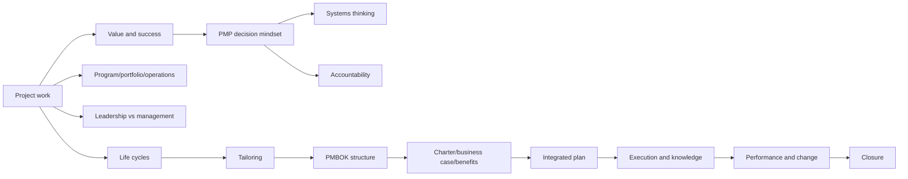
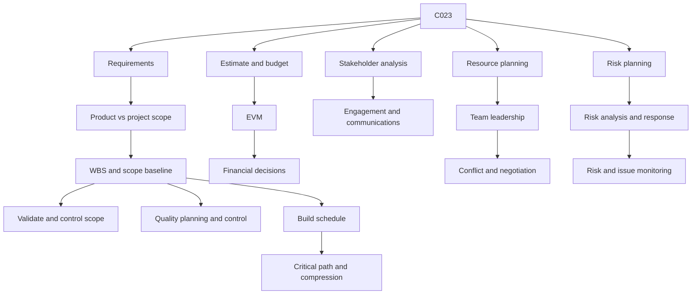
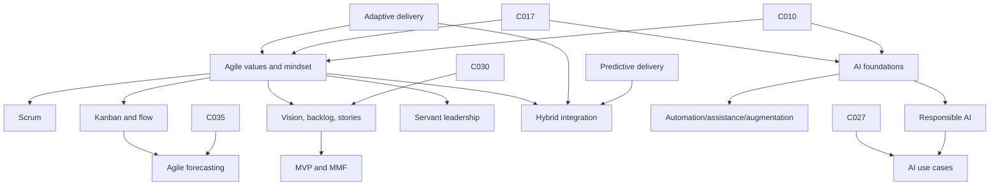
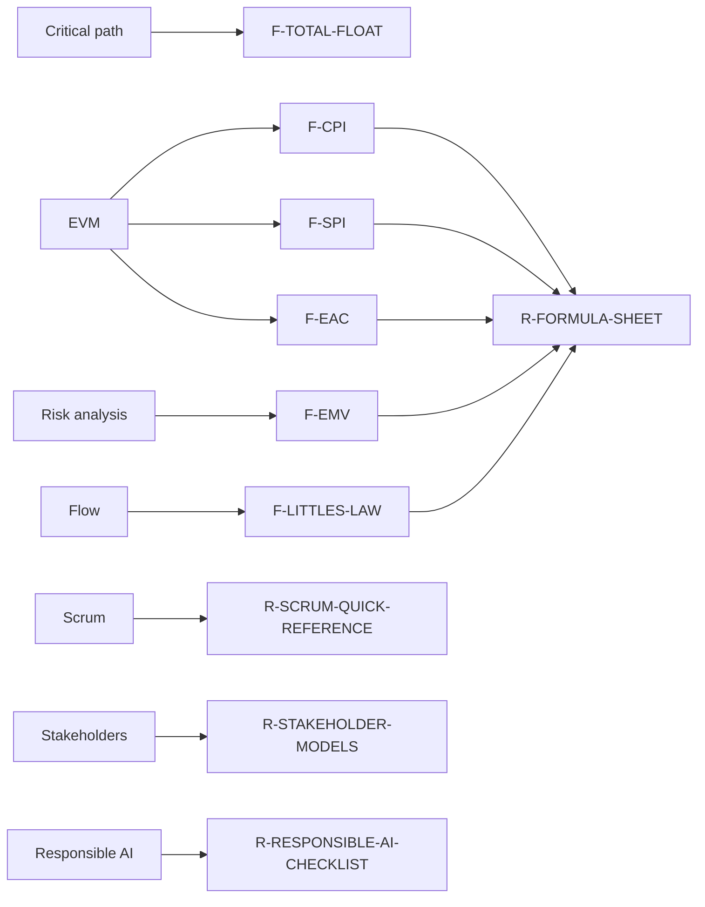

# Knowledge Map

## Concept topology

The full node and edge set is canonical in `data/knowledge_graph.json`. This
document highlights major prerequisite clusters and transfer relationships for
human review.

## Foundation and integration cluster

## Delivery mechanics cluster

## Agile, hybrid, and AI cluster

## Shared asset map

## Review questions

Human architecture review should confirm that prerequisite edges reflect
instructional necessity rather than mere topical association; that related
links are reciprocal and useful; that no concept has become an unbounded
catch-all; and that shared assets reinforce rather than duplicate lesson
content.
